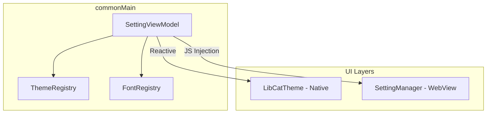

# LibCat 🐱

[](https://kotlinlang.org/docs/multiplatform.html)
[](https://developer.android.com/about/dashboards)
[](https://www.apple.com/ios/)
[](https://opensource.org/licenses/MIT)

**LibCat** adalah library Kotlin Multiplatform (KMP) modern yang dirancang untuk manajemen tema (font, ukuran teks, dan skema warna) secara terpadu. LibCat memastikan pengalaman visual yang konsisten antara komponen **Native Compose Multiplatform** dan konten **WebView** (via CSS injection), berjalan di Android dan iOS.

---

## 🚀 Kenapa LibCat?

Banyak aplikasi menghadapi masalah "dua sumber kebenaran" (two sources of truth) saat mengelola tema: satu untuk UI Native (Jetpack Compose) dan satu lagi untuk konten WebView (HTML/CSS). Hal ini sering menyebabkan ketidaksinkronan visual dan overhead pengembangan.

LibCat menyelesaikan masalah ini dengan:
- **Unified State**: Menggunakan satu `SettingViewModel` sebagai sumber kebenaran tunggal yang reaktif.
- **Dual-Mode Sync**: Mengupdate UI Native (via `LibCatTheme`) dan WebView (via `SettingManager`) secara otomatis saat pengguna mengubah preferensi.
- **Cross-Platform**: Berbagi logika bisnis, persistensi data (DataStore), dan registry tema antara Android dan iOS.

---

## 📦 Instalasi

Tambahkan dependency ke modul `commonMain` di `build.gradle.kts` project Anda:

```kotlin
kotlin {
    sourceSets {
        commonMain.dependencies {
            implementation("com.github.elpafras:LibCat:{version}") // Ganti dengan versi terbaru
        }
    }
}
```

**Requirements:**
- Kotlin 2.4.10+
- Compose Multiplatform 1.11.1+
- Android API 26+
- iOS 13+

---

## ⚡ Quick Start (3 Langkah)

### 1. Inisialisasi SettingViewModel
Buat instance ViewModel menggunakan factory. Disarankan untuk menggunakan DI (Dependency Injection) seperti Koin atau Hilt.

```kotlin
// Contoh inisialisasi manual
val repository = SettingDataStoreRepository(createDataStore(context))
val settingViewModel = SettingViewModel(repository)
```

### 2. Pasang LibCatTheme di Root
Bungkus seluruh konten aplikasi Anda dengan `LibCatTheme` agar semua komponen Material3 otomatis tersinkronisasi.

```kotlin
setContent {
    LibCatTheme(viewModel = settingViewModel) {
        // Seluruh komponen Material3 di bawah ini otomatis mengikuti tema
        MainAppContent()
    }
}
```

### 3. Tampilkan UI Pengaturan
Gunakan `SettingBottomSheet` yang sudah disediakan untuk memberikan kontrol penuh kepada pengguna.

```kotlin
SettingBottomSheet(
    show = isShowingSettings,
    onDismiss = { isShowingSettings = false },
    viewModel = settingViewModel
)
```

---

## 🛠️ Penggunaan: Dua Mode

### A. Mode Native Compose
Komponen Material3 (Text, Card, Button, dll) akan otomatis mendeteksi perubahan tema dari `LibCatTheme`. Jika Anda membutuhkan akses manual ke gaya teks:

```kotlin
@Composable
fun MyNativeContent(viewModel: SettingViewModel) {
    val style = rememberSettingTextStyle(viewModel)
    
    Text(
        text = "Teks ini otomatis mengikuti pengaturan font & tema",
        fontSize = style.fontSize,
        fontFamily = style.fontFamily,
        color = style.themeColors.textColor
    )
}
```

### B. Mode WebView
Untuk konten berbasis HTML, LibCat menyuntikkan CSS secara reaktif ke dalam DOM.

**Android:**
```kotlin
val manager = SettingManager(viewModel, fontInjector)
manager.bind(webView, lifecycleOwner)

webView.webViewClient = object : WebViewClient() {
    override fun onPageFinished(view: WebView, url: String) {
        manager.notifyPageReady(view)
    }
}
```

**iOS:**
```kotlin
val manager = SettingManagerIOS(viewModel, fontInjector)
manager.bind(wkWebView)
// Panggil manager.notifyPageReady(wkWebView) di WKNavigationDelegate
```

---

## 🎨 Kustomisasi Tema & Font

### Menambah Tema Baru
Daftarkan tema baru di `ThemeRegistry`. Setiap tema mendukung pemetaan lengkap ke slot Material3 `ColorScheme`.
- ID tersedia saat ini: `hvs`, `padang_pasir`, `malam_cerah`, `batang_kayu`, dll.

### Menambah Font Baru
1. Letakkan file `.ttf` di:
   - `commonMain/composeResources/font/` (Untuk Native)
   - `androidMain/assets/font/` (Untuk WebView Android)
2. Daftarkan nama file tersebut di `FontRegistry`.

> **Note:** Karena perbedaan mekanisme rendering, saat ini font perlu didaftarkan di dua lokasi tersebut.

---

## 📱 Platform Support

| Fitur | Android | iOS |
|---|:---:|:---:|
| Native Compose Theming | ✅ | ✅ |
| WebView Sync | ✅ | ✅ |
| DataStore Persistence | ✅ | ✅ |
| Material3 Integration | ✅ | ✅ |

---

## 📐 Arsitektur



`SettingViewModel` bertindak sebagai *Source of Truth* tunggal yang mendistribusikan state reaktif ke seluruh layer UI.

---

## ⚠️ Batasan Saat Ini (Known Limitations)

- **Double Font Assets**: Font harus diduplikasi di Compose Resources dan Android Assets untuk mendukung WebView.
- **Sanitasi JS**: Input tema saat ini hanya menggunakan sanitasi dasar untuk injeksi JavaScript.
- **Dynamic Themes**: Penambahan tema secara dinamis saat runtime (tanpa modifikasi registry) belum didukung sepenuhnya.

---

## 🤝 Kontribusi

Kami menerima kontribusi dalam bentuk Issue Report maupun Pull Request. Silakan baca [CONTRIBUTING.md](CONTRIBUTING.md) untuk panduan lebih lanjut.

---

## 📄 Lisensi

MIT License. Copyright (c) 2026 LibCat Team.

Lihat file [LICENSE](LICENSE) untuk detail lengkap.
